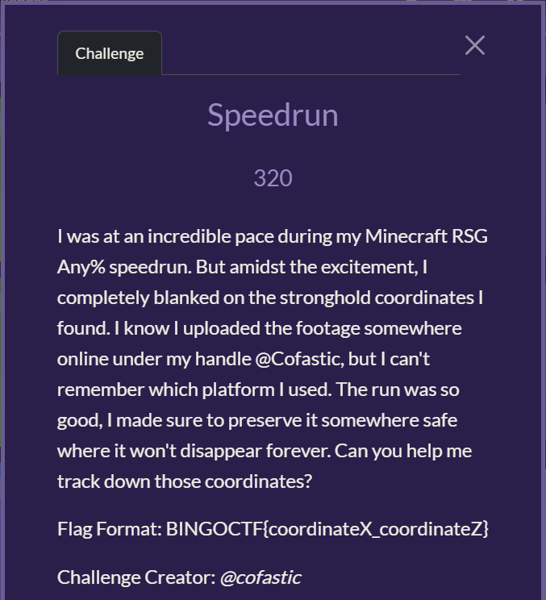
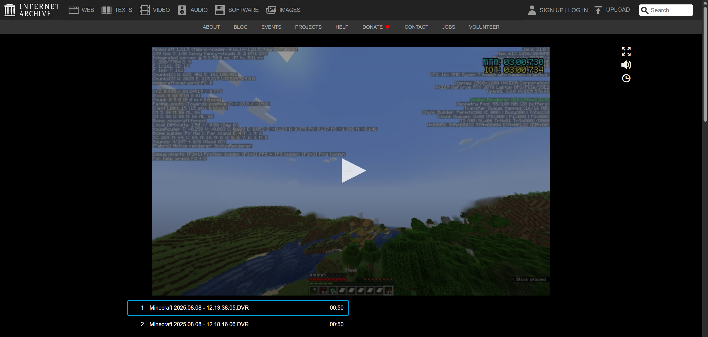
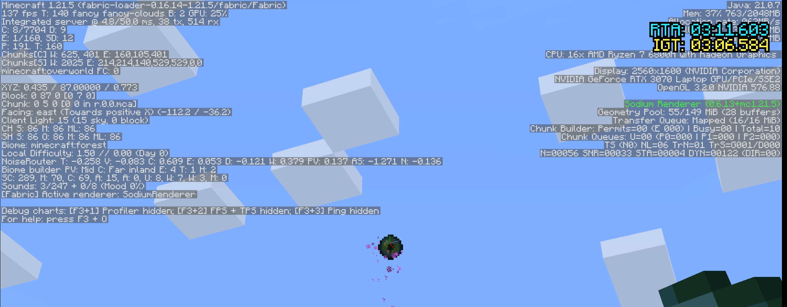
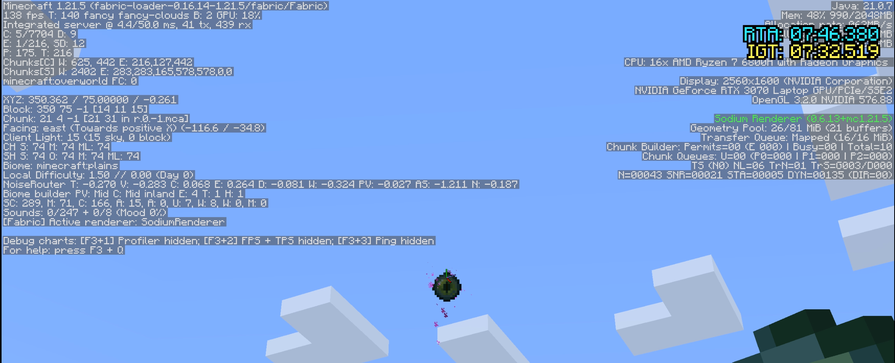
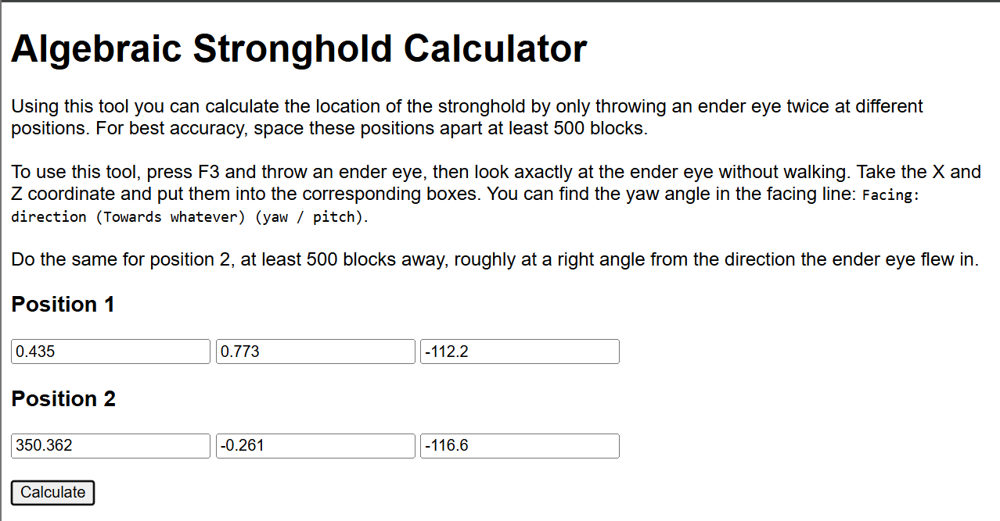
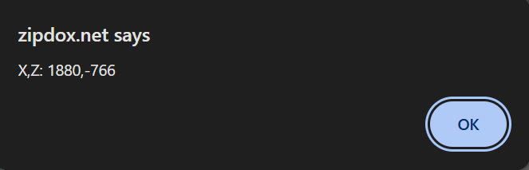

# BingoCTF - Speedrun Write-up (Challenge Creator: @Cofastic)

> “I was at an incredible pace during my Minecraft RSG Any% speedrun. But amidst the excitement, I completely blanked on the stronghold coordinates I found. I know I uploaded the footage somewhere online under my handle @Cofastic, but I can't remember which platform I used. The run was so good, I made sure to preserve it somewhere safe where it won't disappear forever. Can you help me track down those coordinates?”

**Flag Format:** `BINGOCTF{coordinateX_coordinateZ}`

---

For someone who has exprience playing Minecraft, this challenge seems pretty easy and stright forward to me. Based on the question description, I need to search for “footage”s containing coordinates of the minecraft stronghold uploaded by @Cofastic.  

To start off my search, I went on common video uploading sites like YouTube, Twitch and even Tiktok, the user cofastic does exist but I couldn't find any Minecraft videos. 

After searching online for a while, I ended up on the Internet Archives. And with a simple searched for the user "Cofastic", I found two Minecraft videos uploaded by Cofastic on the Internet Archive.  

Inside these two videos, I can see the player throwing an “Eye of Ender” (An item when thrown will fly towards the Stronghold). In addition, the coordinate of the player when throwing the "Eye of Ender" in the two videos are different.  

Looking at the left side of the video, the X and Z coordinates, and the direction the player is facing can be seen.

- **Location 1:** X = 0.435, Z = 0.773, Yaw = -112.2 degree

 
- **Location 2:** X = 350.362, Z = -0.261, Yaw = -116.6 degree  

After obtaining the X and Z coordinates, and Yaw (Angle facing). With these information two lines can be graphed out and the intersect will be the coordinate of the stronghold!

To do this quickly, I decided to use a stronghold calculator tool online to calculate quickly calculate the exact location.  

The final location is (1880, -766). 

With that I found the flag to be `BINGOCTF{1880_-766}`, :D

